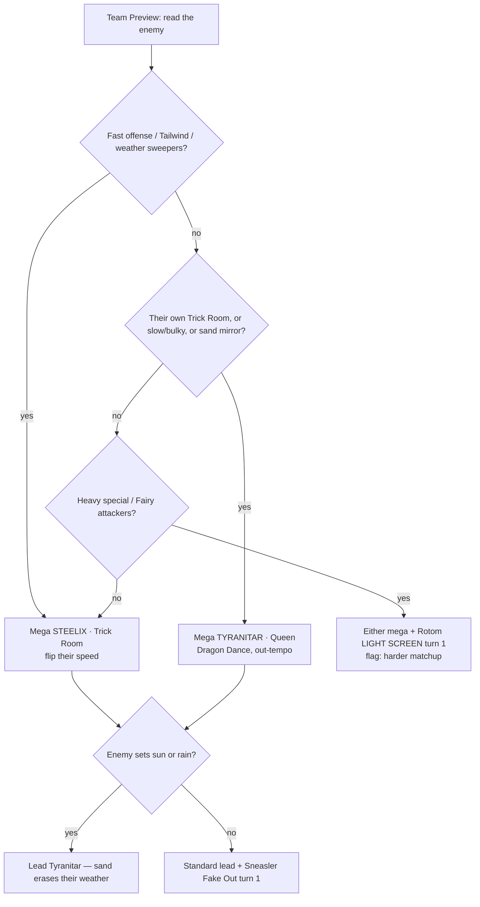

# How to Choose Your Mode from the Enemy's Team — step by step

> **The decision procedure** for piloting the two-mode Mega Steelix team ([[pokemon-champions-team-building/mega-steelix-wolfey-two-mode-team|#3]]). You carry two Megas but commit to **one per battle** — this is how to pick it at Team Preview by reading the opponent. It's the human-readable version of the [visual guide](steelix-synergy-guide.html)'s **Game Plan Assistant**.
> **Grounded in real matches:** Wolfey's Indianapolis run — incl. the Top 4 vs Michael Zhang ([`vEHhu1xlUjg`](https://www.youtube.com/watch?v=vEHhu1xlUjg)) and the finals vs Arsal Puri ([[pokemon-champions-team-building/finals-case-study-sand-vs-sun]]).

## Your two modes (know these cold)

| Mode | Mega | You want to be… | Beats |
|---|---|---|---|
| **B · Trick Room** | **Steelix** | the **slowest** (Sinistcha flips speed → 30-Spe Steelix moves first) | fast offense, Tailwind, weather sweepers |
| **A · Queen** | **Tyranitar** | the **fastest & strongest** (stack Dragon Dance) | slow/bulky teams, Trick Room teams |

## The 6 steps

**Step 1 — Read their speed plan (the biggest question).**
- Fast & weather-less — Tailwind, Choice Scarf, naturally fast, hyper-offense → **Trick Room mode (Steelix).** Flip their speed; your slow mons move first.
- Slow / bulky, **or they have their own Trick Room** (Sinistcha, Oranguru, Cresselia, **Froslass**) → **lean Queen mode (Tyranitar + Dragon Dance).** Don't fight over Trick Room — out-tempo with DD instead. Be ready to play *under* their TR if they set it first.

**Step 2 — Check the weather.**
- Enemy sun (Charizard-Y, Torkoal) or rain (Pelipper) → your **Tyranitar's sand erases it.** Lead Tyranitar either way; the weather war favors you, and sand powers Steelix's Sand Force.
- Enemy *also* has sand (their own Tyranitar / Hippowdon) → it's a **sand mirror**; win it by being the better sand abuser (your Steelix/Tyranitar bulk) — usually tips you toward **Queen**.

**Step 3 — Find what threatens your wall (Steelix).**
- Physical / spread Earthquake (Garchomp, Landorus) → Steelix **walls it** → **Steelix mode + Wide Guard** is comfortable.
- Heavy **special / Fairy** (Floette, Flutter Mane, Charizard) → that's Steelix's soft side (low Sp.Def) → **Rotom Light Screen is mandatory**, lean Queen, and flag the matchup as *harder*.

**Step 4 — Commit the mega + lead.**
- Fast / weather / physical enemy → **Mega Steelix (Trick Room)**, lead **Steelix + Tyranitar**.
- Slow / TR / sand-mirror enemy → **Mega Tyranitar (Queen)**, lead **Sneasler + Tyranitar** (Fake Out buys the Dragon Dance).
- Heavy-special enemy → either mega, but **Rotom Light Screen turn 1**; expect a grind.

**Step 5 — Every game, regardless of mode.**
Sneasler **Fake Out** turn 1 for tempo · **Sinistcha** pivots in/out for free Sitrus healing on your wall · **Rotom** burns the top physical threat or screens the special one.

**Step 6 — Adapt between games.**
You can switch modes game-to-game. Wolfey did exactly this at Indianapolis — **Steelix-mode in his early rounds, Tyranitar-mode in the later rounds.** After Game 1, pick the mega that punishes what they actually brought.

## Decision flowchart

## Wolfey's real mode log (the procedure in the wild)

| Round | Opponent's team | Mode Wolfey leaned | Why (by the steps) | Result |
|---|---|---|---|---|
| Early rounds | (various) | **Steelix / Trick Room** | fast/offensive fields → flip speed (Step 1) | advanced |
| Top 4 | **Michael Zhang** — Mega Tyranitar + **Mega Froslass** + H-Arcanine + Hydreigon + Corviknight + Garchomp (sand / TR-capable) | **Tyranitar / Queen** ("later rounds Tyranitar-oriented") | their own sand + Froslass Trick Room → don't fight TR, out-tempo (Steps 1–2) | **Wolfey won** (Zhang 3rd) |
| Finals | **Arsal Puri** — Sun (Mega Charizard-Y + Mega Floette + Venusaur + …) | **Steelix / Trick Room** | fast sun offense + weather war → flip speed, lead Tyranitar vs sun (Steps 1–2) | **Wolfey lost** — 2nd |

## The honest caveat (learned in the finals)

**Reading the matchup right doesn't guarantee the win.** Vs Arsal's Sun team, Wolfey chose correctly (Trick-Room Steelix, Tyranitar for the weather war) and *still lost the set* — the Sun build (Fairy offense + its own Trick Room) was simply the better team in that clash. So the guide's job — and the [Game Plan Assistant](steelix-synergy-guide.html)'s job — is not just "here's the mode," but **"here's the mode, and here's how favorable this matchup actually is."** When it's a bad matchup, play for your outs; don't auto-pilot. (Same discipline as the hireui candidate ADR: [[pokesynergy-niche-business-tool/hireui-translation]] — surface the tradeoff, don't hide it.)

## Meta note

At Indianapolis, **three of the top teams ran the same "two Megas, two modes, pick by enemy" structure** — Wolfey (Steelix/Tyranitar), Arsal (Charizard-Y/Floette), Zhang (Tyranitar/Froslass). Mode-selection isn't a quirk of one team; it's the **core skill** of the top-meta archetype, which is exactly why a step-by-step guide (and a tool that automates it) is worth having.

## Key Takeaways

- **One question dominates: their speed plan.** Fast → Steelix (Trick Room); slow/their-own-TR → Tyranitar (Queen).
- **Tyranitar is your weather-war win button** vs sun/rain, and your sand-mirror edge.
- **Steelix's soft side is special/Fairy** — Light Screen it and expect a grind.
- **Switch modes between games**, and **be honest about bad matchups** — the tool should flag risk, not just pick a mode.

Cross-links: [[pokemon-champions-team-building/mega-steelix-wolfey-two-mode-team]] · [[pokemon-champions-team-building/finals-case-study-sand-vs-sun]] · [[pokemon-champions-team-building/_index]] · [[pokesynergy-niche-business-tool/hireui-translation]]
