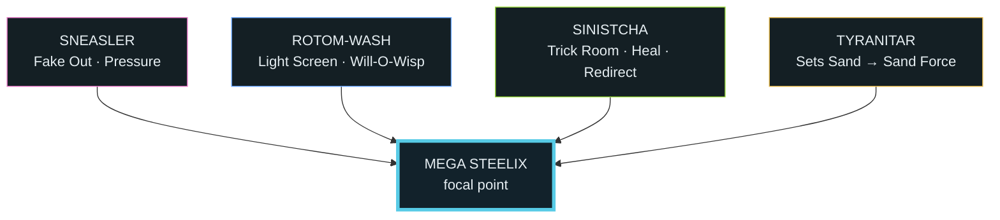
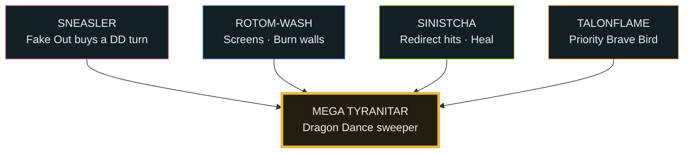

# Worked Example #3 — Wolfey's two-mode Mega Steelix (the tournament build)

> **Source:** [Wolfey's MEGA STEELIX Team COUNTERED the Meta!](https://www.youtube.com/watch?v=sYzs73TeFR8) — `sYzs73TeFR8`, **MrSteelixYourGirl**, 2026-06-01, 37:14, ~37.5K views. The team is **Wolfey's** ([@WolfeyVGC](https://www.youtube.com/@WolfeyVGC)) — piloted to **2nd place at the Indianapolis Regional**; EV spreads by **Justin Tang** (@Unironicpanda-vgc).
> **Also sourced (enrichment):** Wolfey's own first-person vlog [I Entered the First Pokémon Champions Tournament](https://www.youtube.com/watch?v=inQoYsuK2qE) (`inQoYsuK2qE`, **WolfeyVGC**, 2026-08-21, 2:17:55) — the *build journey* (why he abandoned Mega Gengar for Steelix) and the *full tournament run* (Worlds qualification → 2nd place), from the pilot's side. See the [dedicated section](#wolfeys-own-vlog--the-build-journey--the-full-run) below.
> **Verified** in [PokéSynergy](https://pokesynergy.app): imported clean (1 warning — Talonflame's `Covert Cloak` item unrecognized, swap it); all abilities/moves Champions-legal; the **two-Mega build (Steelixite + Tyranitarite) is accepted**.
> **Visual guide (⭐):** [interactive synergy + game-plan Artifact](https://claude.ai/code/artifact/5f8135b5-13a2-4afa-a3be-3d2af7da0989) · in-vault copy: [`steelix-synergy-guide.html`](steelix-synergy-guide.html). Mermaid maps below render in Obsidian.

## The idea: one team, two win-conditions — pick from the enemy

Where examples [#1](pokemon-champions-team-building/mega-steelix-speed-swap-team) and [#2](pokemon-champions-team-building/mega-steelix-sand-trick-room-team) each commit to *one* engine, this pro team carries **two Megas and two modes** and **chooses which to run based on the opponent** — the exact "read the enemy → follow a plan" idea worth stealing for a tool:

- **Mode B · Sand Trick Room (Mega Steelix):** Sinistcha sets Trick Room → 30-Speed Steelix moves first; Tyranitar's sand powers Sand Force.
- **Mode A · "Protect the Queen" (Mega Tyranitar):** stack Dragon Dance on Mega Tyranitar until it out-speeds and one-shots everything — *no Trick Room needed*.

## Synergy map — Mode B (Trick Room · Mega Steelix)

## Synergy map — Mode A (Protect the Queen · Mega Tyranitar)

## ⭐ Game plan by enemy team (the feature idea)

The reusable move — a niche tool that reads the enemy lead and hands the player a **step-by-step plan**, not just a damage number:

| If the enemy… | Then… | Mode |
|---|---|---|
| has Tailwind / fast hyper-offense | **Trick Room** (Mega Steelix) — flip their speed | Mode B |
| is slow / bulky / runs its own Trick Room | **Queen** (Mega Tyranitar Dragon Dance) — out-tempo without TR | Mode A |
| leads spread Earthquake (Garchomp etc.) | lead **Steelix + Wide Guard** to shield Tyranitar | support |
| main threat is physical | **Rotom Will-O-Wisp** (burn halves their damage) | every game |
| main threat is special | **Rotom Light Screen** (+ Tyranitar sand SpD) | every game |
| any game, turn 1 | **Sneasler Fake Out** + pivot **Sinistcha** in/out for free Sitrus healing | every game |

## The six

| Mon | Ability | Role | Key set |
|---|---|---|---|
| **Mega Steelix** | Sand Force | TR nuke / **Wide Guard** wall | Heavy Slam · High Horsepower · Wide Guard · Protect |
| **Tyranitar** | Sand Stream | sand setter · **DD sweeper** (the Queen) | Dragon Dance · Rock Slide · Crunch · Protect — *holds Tyranitarite (2nd Mega)* |
| **Sinistcha** | Hospitality | **Trick Room** · heal · redirect | Trick Room · Rage Powder · Life Dew · Matcha Gotcha |
| **Rotom-Wash** | Levitate | damage mitigation (the star) | Will-O-Wisp · Light Screen · Hydro Pump · Protect |
| **Sneasler** | Pressure | disruptor / lead | Fake Out · Dire Claw · Close Combat · Protect |
| **Talonflame** | Gale Wings | priority revenge | Brave Bird · Swords Dance · Tailwind · Protect |

*EV spreads are Justin Tang's (shown in the video, not dictated) — grab Wolfey's rental from the source for exact numbers. Moves above are validated legal in PokéSynergy.*

## Why this belongs in the corpus (the business-tool angle)

The operator's read is the payload: **this graphic format is a product feature.** PokéSynergy (and the niche-tool archetype in [[pokesynergy-niche-business-tool/_index]]) is strongest when it gives a player *"a short reason you can act on"* — and a **"paste the enemy team → get a step-by-step game plan"** view is exactly that, one level up from a damage calculator. It's the same shape as the hireui borrow ([[pokesynergy-niche-business-tool/hireui-translation]]): an **explainable, deterministic, step-by-step recommender** driven by the opponent's constraints. Wolfey's two-mode team is the perfect worked example because the *plan literally changes with the enemy* — so the tool has something non-obvious to tell you.

## Verification notes

- ✅ **Team validated in PokéSynergy** (import): all abilities/moves legal (Sinistcha Hospitality + Rage Powder/Life Dew/Matcha Gotcha, Sneasler Pressure, Gale Wings Talonflame, Sand Force Steelix, Sand Stream Tyranitar). **Two Mega stones on one team accepted** — confirms the dual-Mega, dual-mode plan is buildable. Only warning: Talonflame's `Covert Cloak` item not recognized (swap to a legal item).
- ⚠️ **ASR catch (Rule 12 / wiki-verify):** the auto-caption repeatedly says "Cinccino" for the Trick Room setter; the creator's on-screen graphic **and** the per-Pokémon breakdown both show **Sinistcha** (Hospitality — heal + redirect). Corrected to Sinistcha throughout. ("Cinccino" is not on the team.)
- The exact EVs are Justin Tang's; treat the sets here as validated-legal reconstructions, the rental code (from the video) as the source of truth.

## Wolfey's own vlog — the build journey & the full run

*Added from Wolfe Glick's first-person vlog (`inQoYsuK2qE`, 2:17:55) — the same Indianapolis event told from the pilot's chair. This is what the third-party breakdown above doesn't cover: **why** the team exists and **how the run actually went.** Claims spot-checked against the topic's other Indianapolis entries.*

**Why Steelix (the build journey).** Wolfey's whole season was on the line: after a 4-month break he'd attended only ~4 majors and had **not yet qualified for Worlds** — his streak of *every* Worlds since 2011, in the 10-year-anniversary year of his 2016 title. He first tried to build around his personal favourite, **Mega Gengar** (Poison threatens Floette; Shadow Tag traps Charizard while a partner overwrites its sun) — but **couldn't make it work**: Regulation M-A is "chock full of powerful physical attackers" that all pressure Gengar and aren't threatened back. He pivoted to **Mega Steelix** — a nostalgic pick (he'd run Mega Steelix back in 2018) that happens to *counter this meta*: enormous bulk, Sand Force damage, and **Wide Guard** to blank the spread Earthquakes/Rock Slides the format leans on.

**Why the second Mega is Tyranitar (the two-mode key, in his words).** The reason to give Tyranitar its *own* Mega Stone is the **weather war**: if Charizard and Tyranitar both Mega-evolve on the same turn, **Tyranitar wins the speed tie and its Sand overwrites Charizard's Sun** — cutting off Solar Beam and the sun-boosted damage that is "the single [scariest thing]" in the format. Because Mega Charizard-Y is the format's defining threat, a dual-Mega that can *flip the weather on demand* is worth the deckbuilding cost. That, plus a **Dragon Dance** Tyranitar that snowballs into a sweeper ("the Queen," Mode A), is the team's second win-condition — no Trick Room required.

**The run — 2nd place, and Worlds locked.** A strong Swiss phase (**~11–1**) into top cut; a grindy **Top 16** (almost every set went to game 3) survived by a triple-Swords-Dance Talonflame behind Rage Powder; **Top 8** vs an unusual **dual-Mega Dragonite + Mega Froslass** team, won on a clutch **Dire Claw paralysis** — and *making Top 8 clinched his 2026 Worlds invite* (the emotional peak of the vlog). **Semifinals** vs a **Hisuian Arcanine** (Rock Head + Focus Sash Head Smash) / Corviknight / Garchomp / Mega Froslass team, where the long-hidden Steelix ground out a **setup-less Corviknight** 1-on-1 (that Corviknight had no Bulk Up / Iron Defense / Body Press / recovery, so Steelix simply out-bulked it). **Finals** vs a **Mega Charizard-Y sun team** (Focus-Sash Charizard + Sleep-Powder Venusaur + Choice-Scarf Garchomp) → **2nd place** — the loss dissected in [[pokemon-champions-team-building/finals-case-study-sand-vs-sun]].

**A piloting meta-note (from the casters).** Wolfey **never showed Steelix on stream for ~24 hours** of the event — opponents kept team-previewing into "the spectre of a Steelix they hadn't seen." The team's shape (two hidden Megas, mode chosen at preview) is *what makes that bluff possible* — a real edge on top of the raw matchup math.

## Key Takeaways

- **Two Megas, two modes, pick by matchup** — the most flexible of the three Steelix builds; the plan is a *decision*, not a fixed line.
- **Born from a meta read, not a gimmick** — Wolfey reached for Steelix only after his favourite Mega Gengar folded to the physical-attacker-heavy Reg M-A meta; the dual-Mega Tyranitar exists specifically to **win the weather war vs Mega Charizard-Y**.
- **Tournament-validated end-to-end** — ~11–1 Swiss → Top 8 (**Worlds qualification**) → **2nd place** at the first-ever Champions tournament, with a 24-hour "hidden Steelix" bluff as a bonus edge.
- **The "enemy team → step-by-step plan" graphic is the reusable product idea** — a niche tool that recommends a game plan, not just a calc (ties to [[pokesynergy-niche-business-tool/hireui-translation]]).
- **Rotom-Wash is the engine** here (Light Screen + Will-O-Wisp make the sand core un-KO'able), and **Sinistcha** is the glue (TR + heal + redirect).
- Tournament-proven (Wolfey, 2nd @ Indianapolis) — the "meta/pro" counterpart to #1 (off-meta gimmick) and #2 (ladder-traditional).

Cross-links: [[pokemon-champions-team-building/mega-steelix-speed-swap-team]] · [[pokemon-champions-team-building/mega-steelix-sand-trick-room-team]] · [[pokemon-champions-team-building/reusable-team-building-method]] · [[pokesynergy-niche-business-tool/hireui-translation]]
